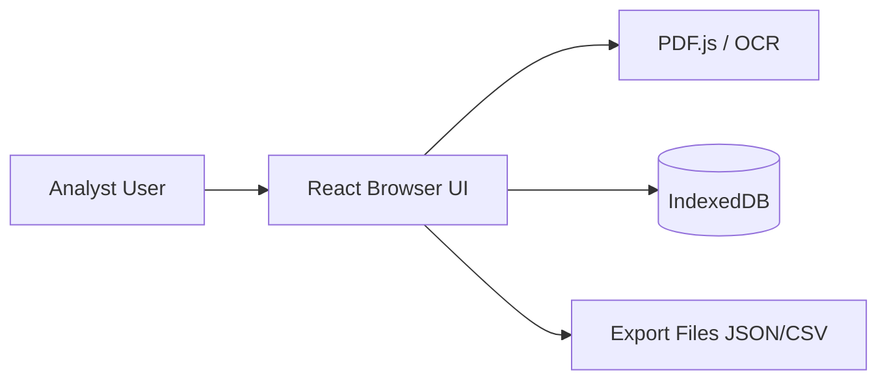
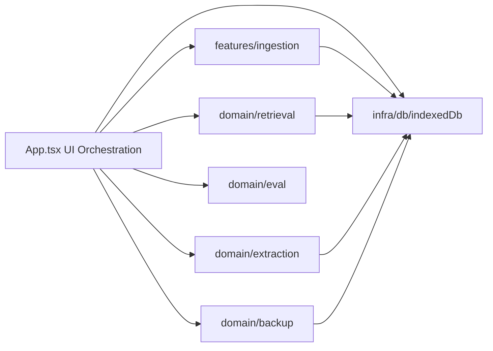

# Architecture Overview

PlanScribe Local is a browser-only application with no backend services.

## System Context

## Component View

## Layering Rules

1. `src/domain/*` contains pure logic and data transformations.
2. `src/features/*` integrates domain logic into end-user workflows.
3. `src/infra/*` encapsulates persistence and infrastructure details.
4. `src/App.tsx` coordinates UI state and calls into the above layers.

## Source of Truth

1. Auto-generated dependency map: `docs/generated/dependency-graph.md`
2. API reference: `docs/generated/api/index.html`
