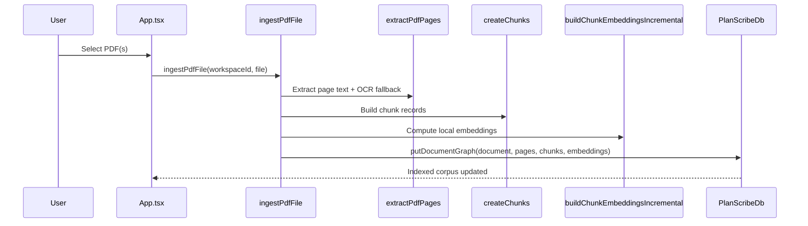
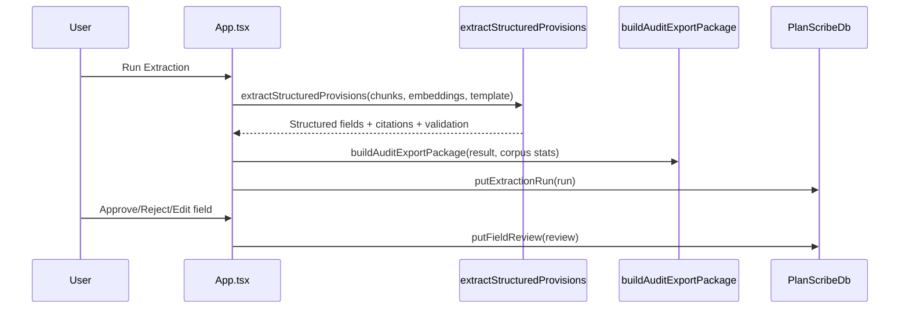
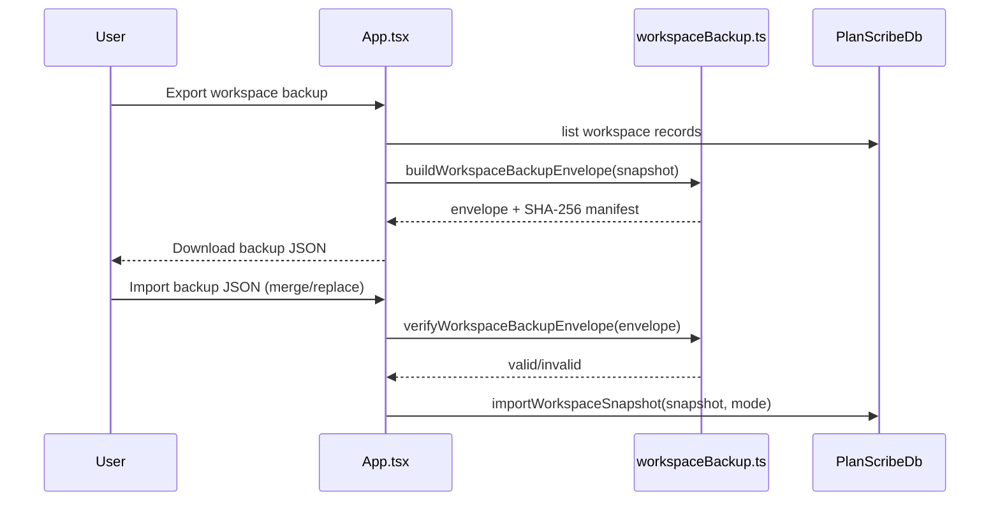

# Process Flows

## PDF Ingestion Flow

```mermaid
sequenceDiagram
  participant User
  participant UI as App.tsx
  participant Ingest as ingestPdfFile
  participant Parser as extractPdfPages
  participant Chunk as createChunks
  participant Embed as buildChunkEmbeddingsIncremental
  participant DB as PlanScribeDb

  User->>UI: Select PDF(s)
  UI->>Ingest: ingestPdfFile(workspaceId, file)
  Ingest->>Parser: Extract page text + OCR fallback
  Ingest->>Chunk: Build chunk records
  Ingest->>Embed: Compute local embeddings
  Ingest->>DB: putDocumentGraph(document, pages, chunks, embeddings)
  DB-->>UI: Indexed corpus updated
```

## Structured Extraction + Review Flow

```mermaid
sequenceDiagram
  participant User
  participant UI as App.tsx
  participant Extract as extractStructuredProvisions
  participant Audit as buildAuditExportPackage
  participant DB as PlanScribeDb

  User->>UI: Run Extraction
  UI->>Extract: extractStructuredProvisions(chunks, embeddings, template)
  Extract-->>UI: Structured fields + citations + validation
  UI->>Audit: buildAuditExportPackage(result, corpus stats)
  UI->>DB: putExtractionRun(run)
  User->>UI: Approve/Reject/Edit field
  UI->>DB: putFieldReview(review)
```

## Backup and Restore Integrity Flow

```mermaid
sequenceDiagram
  participant User
  participant UI as App.tsx
  participant Backup as workspaceBackup.ts
  participant DB as PlanScribeDb

  User->>UI: Export workspace backup
  UI->>DB: list workspace records
  UI->>Backup: buildWorkspaceBackupEnvelope(snapshot)
  Backup-->>UI: envelope + SHA-256 manifest
  UI-->>User: Download backup JSON

  User->>UI: Import backup JSON (merge/replace)
  UI->>Backup: verifyWorkspaceBackupEnvelope(envelope)
  Backup-->>UI: valid/invalid
  UI->>DB: importWorkspaceSnapshot(snapshot, mode)
```
