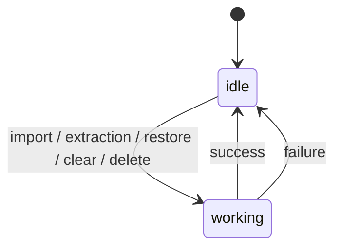
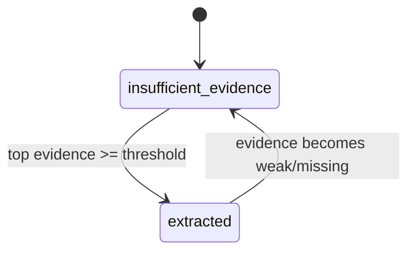
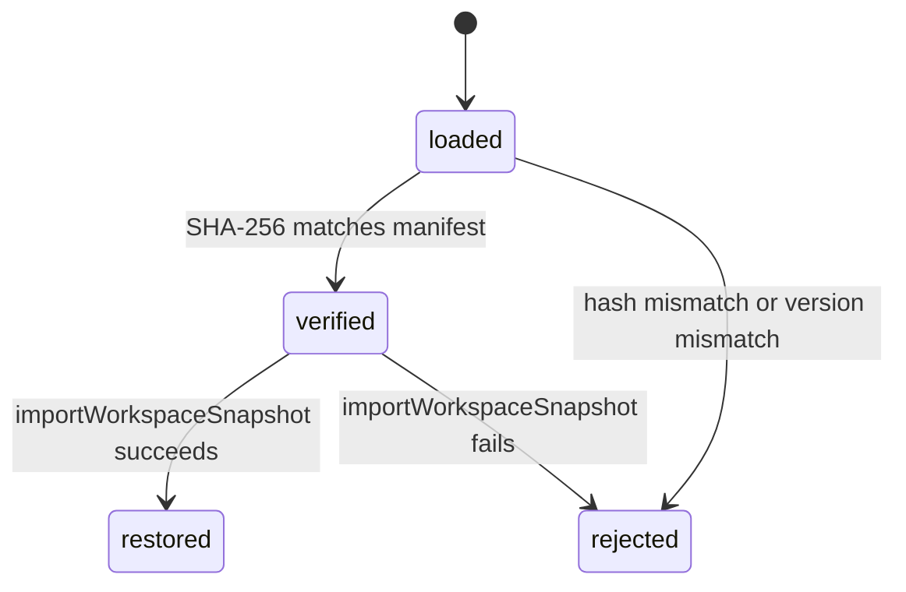

# State Machines

## UI Async State

The app uses a coarse UI execution state (`idle` / `working`) for long-running operations.

## Extraction Field Status

Each extracted field transitions between confidence outcomes:

## Backup Verification State

